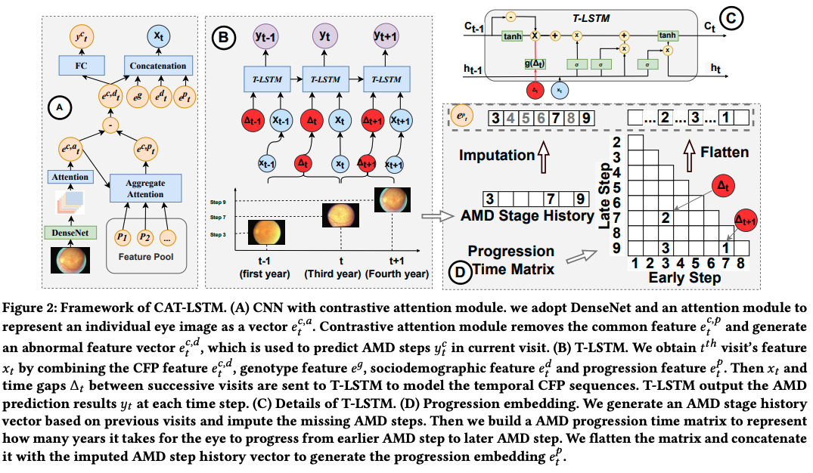
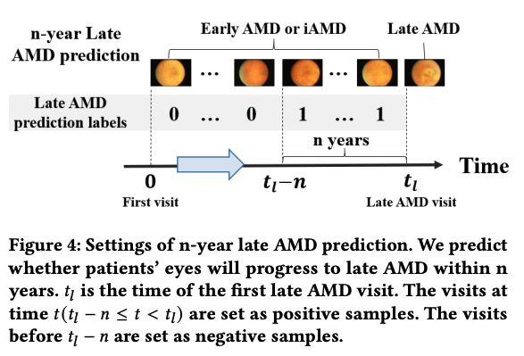
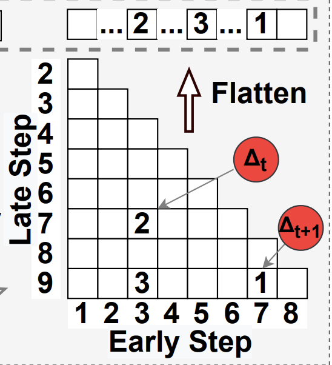
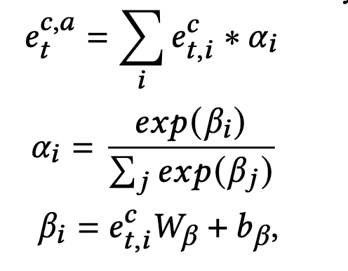
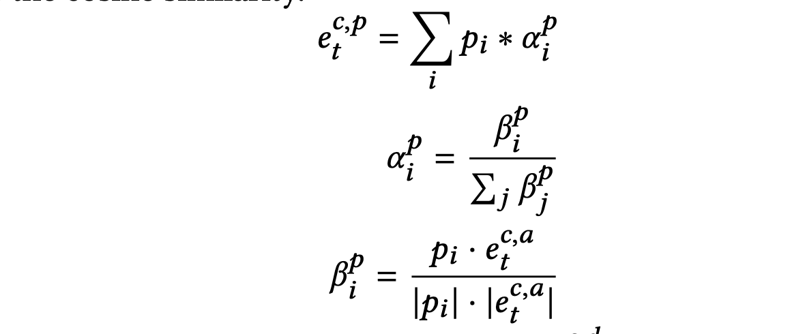

# Predicting Age-Related Macular Degeneration Progression with Contrastive Attention and Time-Aware LSTM

Authors utilize a time-aware long short-term memory (T-LSTM) to model patients’ temporal visits with **irregular time gaps**. The input of T-LSTM consists of *genotype information*, *sociodemographics*, *CFP feature* vectors and *AMD progression* information. 

### 进展时间的编码
关于进展时间的编码， 横坐标是某次检测的level，纵坐标是此后多次进展的level，matrix里面为进展所花的时间，有多次进展的时候，就会存在很多列都有数值，因为每次进展都可以作为起始的。

### contrastive attention module

首先对feature map加一个attention，具体就是1x1conv softmax以后做权重，然后feature map加权平均

contrastive 部分按照数据metadata（年龄，性别，是否吸烟）分了pool，平均一下feature map（应该是$e_t^{c,a}$），然后使用cosine similarity，加权平均了一下，减去加权平均对feature。类似PCA，降维，稀疏化的效果？ 是否直接聚类更有效果？

